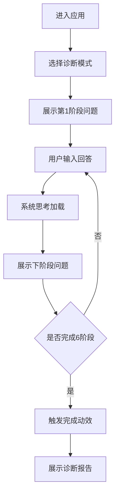

## 1. 产品概述

DeepMiner是一款现代化的人工智能诊断对话工具，专为产品设计师和业务分析师打造。通过结构化的6阶段提问流程，帮助用户深度剖析页面转化问题，系统性地优化商业转化路径。

目标用户：产品经理、UX设计师、增长黑客、业务分析师。核心价值：将主观的设计经验转化为可量化的诊断框架，提升页面转化率。

## 2. 核心功能

### 2.1 用户角色
无需区分用户角色，所有用户均可完整使用产品功能。

### 2.2 功能模块

DeepMiner采用单页面应用设计，核心功能集中在以下模块：

1. **对话界面**：左侧系统卡片提问，右侧用户气泡回答，支持渐进式对话推进
2. **模式选择器**：C端模式、B端模式、创建模式三选一，发送首条消息后锁定
3. **悬浮阶段轴**：6个诊断阶段可视化进度，支持点击跳转历史问题
4. **侧边栏历史**：展示历史对话流程，支持新建会话
5. **模态弹窗**：创建模式配置、最终诊断报告展示

### 2.3 页面详情

| 页面名称 | 模块名称 | 功能描述 |
|---------|---------|---------|
| 主界面 | 左侧边栏 | 显示DeepMiner Logo，点击可新建会话；展示历史对话列表 |
| 主界面 | 对话区域 | 系统卡片左对齐显示，用户气泡右对齐显示；支持平滑滚动 |
| 主界面 | 底部输入区 | 多行文本输入框、模式选择下拉菜单、发送按钮；首条消息后锁定模式选择 |
| 主界面 | 悬浮阶段轴 | 默认隐藏，首条消息后显示；6个阶段竖向排列，点击可跳转对应问题 |
| 创建模式弹窗 | 配置输入 | 支持JSON/Markdown格式输入，带格式校验和错误提示 |
| 诊断报告弹窗 | 结果展示 | 宽屏模态框展示Markdown格式的完整诊断报告 |

## 3. 核心流程

用户操作流程：

1. 用户进入应用，选择诊断模式（C端/B端/创建模式）
2. 选择C端模式后，系统自动展示第1阶段商业基座的问题卡片
3. 用户在底部输入答案并发送，用户回答以气泡形式显示
4. 系统显示思考Loading状态，随后展示第2阶段问题卡片
5. 右侧悬浮阶段轴同步更新进度，完成阶段显示拼图碎片图标
6. 重复步骤3-5直至完成全部6个阶段
7. 触发完成动效，弹出最终诊断报告模态框

## 4. 用户界面设计

### 4.1 设计风格

- **配色方案**：纯白背景(#FFFFFF)、浅灰色边界(#E5E7EB)、深石板色文字(#1F2937)
- **强调色**：低调的石板蓝(#475569)用于高亮和交互状态
- **按钮样式**：圆角矩形，2px圆角，hover状态轻微阴影
- **字体**：系统默认无衬线字体，14px正文，16px标题，12px辅助文字
- **图标风格**：使用Lucide React图标库，线性风格，1.5px描边
- **布局风格**：卡片式布局，8px间距网格系统，柔和的阴影效果

### 4.2 页面设计概览

| 页面名称 | 模块名称 | UI元素 |
|---------|---------|---------|
| 主界面 | 左侧边栏 | 240px固定宽度，浅灰背景(#F9FAFB)；Logo使用Hexagon图标配深灰色文字；历史列表项14px字体，hover背景色变化 |
| 主界面 | 对话卡片 | 白色卡片，最大宽度600px，左对齐；标题16px加粗，问题列表14px常规；8px圆角， subtle阴影 |
| 主界面 | 用户气泡 | 深石板色背景(#374151)，白色文字；右对齐显示，最大宽度70%；12px圆角 |
| 主界面 | 输入区域 | 底部悬浮，白色背景带阴影；多行文本框最小高度80px，最大高度200px；发送按钮石板蓝色 |
| 主界面 | 悬浮阶段轴 | 固定右侧，白色卡片背景；竖向排列6个阶段，完成状态显示绿色拼图图标；点击有涟漪效果 |
| 弹窗 | 创建模式 | 居中模态框，最大宽度600px；输入区域带浅灰色占位符；错误提示红色文字12px |
| 弹窗 | 诊断报告 | 宽屏模态框，最小宽度800px；Markdown渲染区域，等宽字体展示数据和表格 |

### 4.3 响应式设计

采用桌面优先设计策略：

- **桌面端**：完整展示2.5栏布局，所有功能完整可用
- **平板端**：侧边栏可收起，悬浮阶段轴自动隐藏，支持手势滑动切换阶段
- **移动端**：单栏布局，侧边栏变为抽屉式导航，对话卡片全宽度显示

### 4.4 动效设计

使用Framer Motion实现平滑过渡：

- **消息出现**：fadeIn + slideUp，duration: 0.3s，ease-out
- **阶段切换**：slideInRight，stagger: 0.1s，展示渐进式加载
- **拼图完成**：scale + rotate组合动效，庆祝撒花效果
- **模态弹窗**：backdrop fadeIn，内容scale从0.95到1，duration: 0.2s