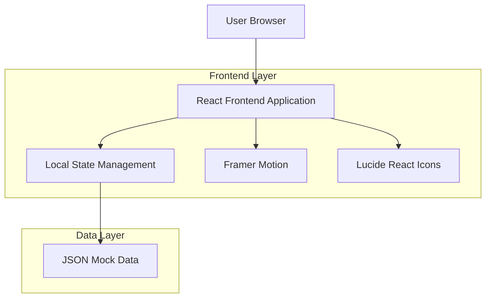
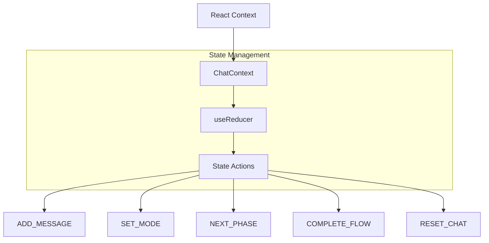
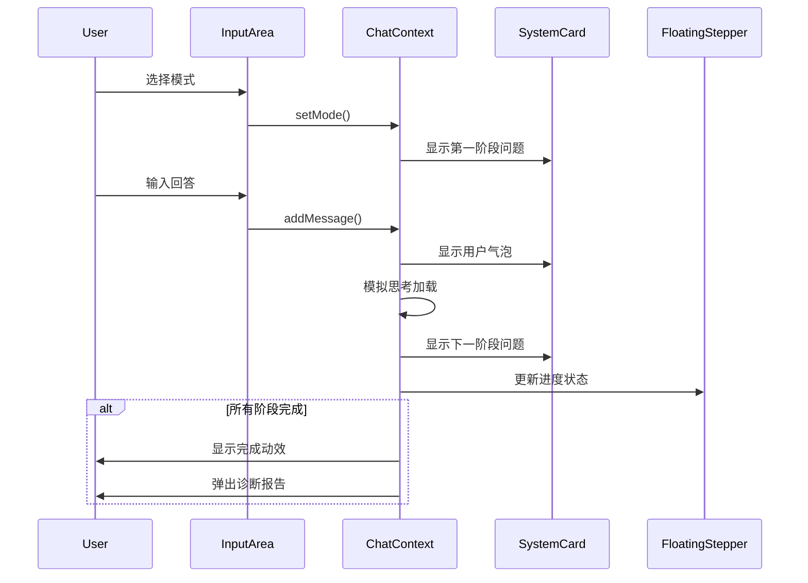

## 1. 架构设计



## 2. 技术描述

- **前端框架**: React@18 + TypeScript
- **样式方案**: Tailwind CSS@3 + PostCSS
- **图标库**: Lucide React@latest
- **动画库**: Framer Motion@latest（可选）
- **初始化工具**: vite-init
- **构建工具**: Vite@4
- **状态管理**: React Context + useReducer
- **后端服务**: 无（纯前端应用，使用本地JSON数据）

## 3. 路由定义

| 路由 | 用途 |
|------|------|
| / | 主界面，包含完整的对话应用 |
| /new | 新建会话，重定向到主界面并清空状态 |

## 4. 核心组件结构

### 4.1 主要组件

```typescript
// 主应用组件
App.tsx
├── Sidebar.tsx          // 左侧边栏
├── ChatArea.tsx         // 主对话区域
│   ├── SystemCard.tsx  // 系统问题卡片
│   ├── UserBubble.tsx  // 用户回答气泡
│   └── InputArea.tsx   // 底部输入区域
├── FloatingStepper.tsx  // 右侧悬浮阶段轴
├── Modals.tsx          // 模态框容器
│   ├── CreateModeModal.tsx   // 创建模式弹窗
│   └── ReportModal.tsx       // 诊断报告弹窗
└── hooks/
    ├── useChatFlow.ts       // 对话流程控制
    ├── useModeLock.ts       // 模式锁定逻辑
    └── useProgress.ts       // 进度管理
```

### 4.2 数据类型定义

```typescript
// 模式配置接口
interface ModeConfig {
  mode_id: string;
  mode_name: string;
  phases: {
    [key: string]: {
      title: string;
      questions: string[];
    };
  };
}

// 消息类型
interface Message {
  id: string;
  type: 'system' | 'user';
  content: string;
  phase?: string;
  timestamp: number;
}

// 对话状态
interface ChatState {
  currentMode: string | null;
  currentPhase: string;
  messages: Message[];
  isModeLocked: boolean;
  isCompleted: boolean;
}

// 阶段进度
interface PhaseProgress {
  phase: string;
  title: string;
  isCompleted: boolean;
  isActive: boolean;
}
```

## 5. 状态管理架构



## 6. 数据模型

### 6.1 本地存储结构

```typescript
// 会话历史（localStorage）
interface ChatSession {
  id: string;
  title: string;
  mode: string;
  startTime: number;
  lastMessageTime: number;
  phaseCount: number;
  isCompleted: boolean;
}

// 用户配置（localStorage）
interface UserConfig {
  customModes: ModeConfig[];
  preferences: {
    theme: 'light' | 'dark';
    animations: boolean;
    sound: boolean;
  };
}
```

### 6.2 默认配置数据

```json
{
  "mode_id": "c_side_growth",
  "mode_name": "C端：流量变现与增长",
  "phases": {
    "1": {
      "title": "商业基座 (Context)",
      "questions": [
        "1.1 这个页面最终要帮公司捞到什么具体商业好处（GMV/拉新/广告）？",
        "1.2 用户滑到这个页面时，他脑子里最原始的欲望是什么（贪便宜/看美女/杀时间）？"
      ]
    },
    "2": {
      "title": "欲望流失 (Drop-off)",
      "questions": [
        "2.1 在实现公司赚钱目标的路上，用户在哪一秒钟最容易关掉页面跑路？",
        "2.2 促使他跑路的具体物理阻力是什么？"
      ]
    },
    "3": {
      "title": "利益冲突 (Conflict)",
      "questions": [
        "3.1 平台希望用户多做什么动作？",
        "3.2 用户为了省钱或省事，本能地想少做什么动作？",
        "3.3 赚钱欲望和白嫖欲望，在屏幕哪个区域正面冲突？"
      ]
    },
    "4": {
      "title": "竞品与套路 (Reference)",
      "questions": [
        "4.1 你参考了哪个App的成熟套路？",
        "4.2 业务模式限制导致你放弃了哪些诱导设计？"
      ]
    },
    "5": {
      "title": "视觉手术 (Action)",
      "questions": [
        "5.1 改版前，这个转化路径有什么物理硬伤导致用户跑路？",
        "5.2 你在界面上放了什么视觉诱饵或物理阻力来强行留住他？"
      ]
    },
    "6": {
      "title": "转化验尸 (Metrics)",
      "questions": [
        "6.1 关键按钮的点击率（CTR）涨了几个点？",
        "6.2 最终的核心转化率提升了多少？"
      ]
    }
  }
}
```

## 7. 组件通信流程



## 8. 性能优化策略

- **虚拟滚动**：对话列表超过50条消息后启用虚拟滚动
- **防抖处理**：用户输入防抖300ms，避免频繁状态更新
- **懒加载**：模态框组件使用React.lazy进行代码分割
- **缓存策略**：模式配置和会话历史本地缓存，减少重复计算
- **动画优化**：使用will-change和GPU加速，避免重排重绘